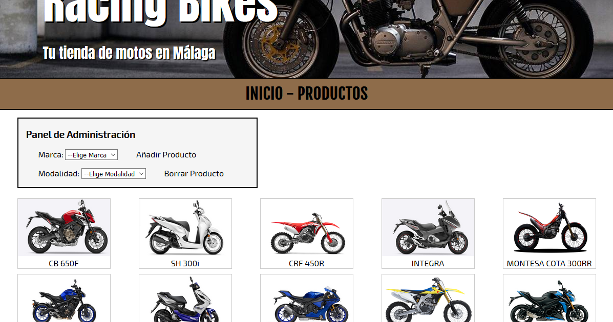

# CRUD

Aplicacion CRUD en JSP y MySQL sobre Motos.

## INDEX

En el *"Index"* encontraras información sobre la web asi como algunas fotos.
Si en la barra de navegación nos movemos hacía la pestaña *"Productos"*
encontraremos una galeria con todos los productos relacionados con la base
de datos asi como un panel de administración.

## PRODUCTOS

En *"Productos"* encontraras un listado de todos los productos en forma de galeria
acompañada de un panel de administracion en el cual podras elegir mostrar los 
productos clasificados por marcas o modalidad, añadir nuevos productos a la base
de datos o eliminarlos, y si haces click sobre la imagen de los productos podras
modificarlos.

## AÑADIR PRODUCTOS

En *"añadir productos"* aparecerá un formulario donde rellenando los campos podras añadir
un nuevo producto a la base de datos.

## ELIMINAR PRODUCTOS

Al hacer click sobre *"Borrar producto"* te aparecerá un formulario para que introduzcas
el nombre del producto que deseas eliminar.

## MODIFICAR PRODUCTOS

Para *"Modificar los productos"* tienes que hacer click sobre la imagen del producto que desees
modificar y aparecerá un formulario para que modifiques los campos que desees.

